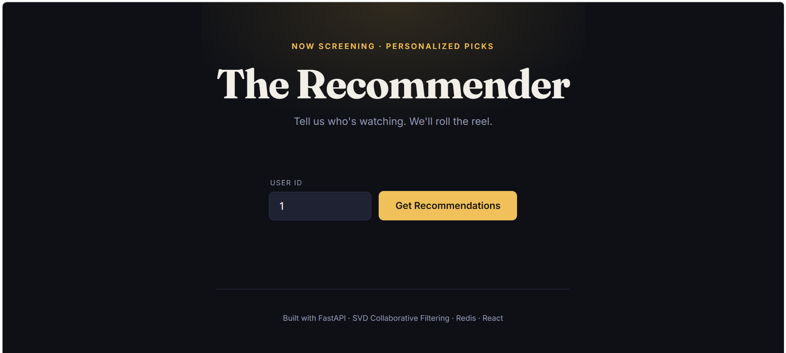
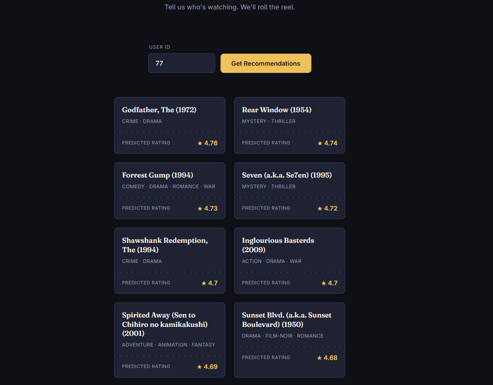
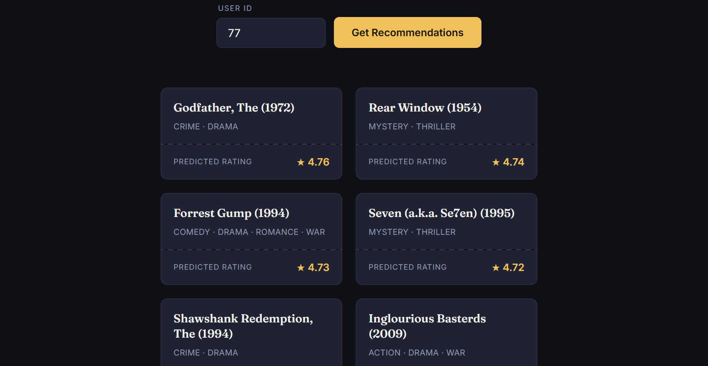

# 🎬 The Recommender — Movie Recommendation Engine

A full-stack movie recommendation system built with collaborative filtering (SVD), served via a FastAPI backend with Redis caching, and a React frontend.

<p align="center">
  
  
  
</p>

## Overview

This app predicts movies a user will enjoy based on their past ratings, using matrix factorization trained on the [MovieLens](https://grouplens.org/datasets/movielens/) dataset (100K+ ratings, 610 users, ~9,700 movies). It mirrors the core approach used by real-world recommendation systems (Netflix, Amazon, Spotify) at a smaller scale.

## Architecture
┌─────────────┐ HTTP ┌──────────────┐ Cache Check ┌─────────────┐
│ React UI │ ──────────────> │ FastAPI │ ────────────────────> │ Redis │
│ (Vite) │ <────────────── │ Backend │ <──────────────────── │ (Upstash) │
└─────────────┘ └──────┬───────┘ └─────────────┘
│ cache miss
▼
┌──────────────┐
│ SVD Model │
│ (surprise) │
└──────────────┘

**Flow:** User requests recommendations → API checks Redis cache first → on cache miss, the trained SVD model scores every unrated movie for that user → top-N results are returned and cached for future requests.

## Tech Stack

| Layer | Technology |
|---|---|
| ML Model | Python, `scikit-surprise` (SVD matrix factorization) |
| Backend | FastAPI, Uvicorn |
| Caching | Redis (Upstash, cloud-hosted) |
| Frontend | React (Vite), vanilla CSS |
| Data | MovieLens 100K dataset (Pandas) |
| Containerization | Docker, Docker Compose |

## How It Works

1. **Training:** An SVD (Singular Value Decomposition) model is trained on the user-movie ratings matrix, learning latent factors that represent user preferences and movie characteristics.
2. **Prediction:** For a given user, the model scores every movie they haven't rated yet, then returns the top N highest-predicted ratings.
3. **Caching:** Since predictions for a given user don't change until the model is retrained, results are cached in Redis for 1 hour to reduce compute load on repeated requests.

## Running Locally

### Prerequisites
- Python 3.9+
- Node.js 18+
- A free [Upstash](https://upstash.com) Redis database (or any Redis instance)

### Backend
```bash
cd backend
pip install -r requirements.txt
python -m app.model        # trains the model, saves model.pkl
uvicorn app.main:app --reload
```
Backend runs at `http://127.0.0.1:8000` — interactive API docs at `/docs`.

### Frontend
```bash
cd frontend
npm install
npm run dev
```
Frontend runs at `http://localhost:5173`.

### Environment Variables
Set your Redis connection string:

## API Reference

`GET /recommendations/{user_id}?n=10`

Returns the top N recommended movies for a given user.

```json
{
  "user_id": 1,
  "recommendations": [
    {
      "movieId": 318,
      "title": "Shawshank Redemption, The (1994)",
      "genres": "Crime|Drama",
      "predicted_rating": 4.87
    }
  ],
  "cached": false
}
```

## Docker

```bash
docker-compose up --build
```
Runs backend and frontend as containers (Redis is cloud-hosted via Upstash, referenced by `REDIS_URL`).

## Future Improvements
- Add a hybrid model combining collaborative + content-based filtering (using genres/tags) to handle cold-start users
- Add user authentication so real users can rate movies and get live-updated recommendations
- Periodic automated retraining pipeline

---
Built as a full-stack ML portfolio project.

